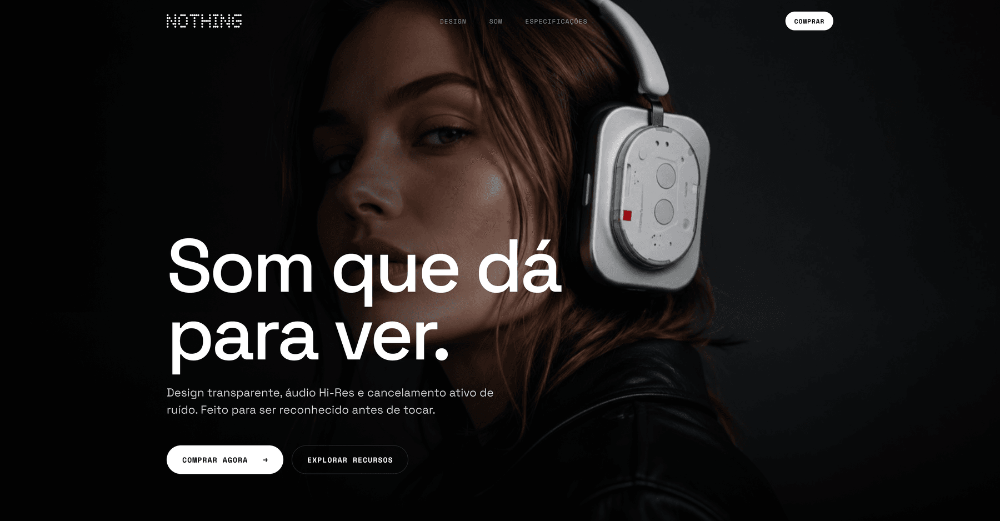

# Nothing Ear — Landing Page (Concept)

A monochromatic, type-led product landing page for the **Nothing Ear** — built from a
brand-DNA study, designed in Figma, then coded faithfully and animated.

> ⚠️ **Concept / spec work.** Not affiliated with or endorsed by Nothing Technology.
> The "Nothing" name and wordmark are trademarks of their respective owner, used here only
> for a non-commercial design concept. Product and lifestyle imagery is **AI-generated**.

**Live demo:** [nothing-ear.vercel.app](https://nothing-ear.vercel.app/)

<p align="center">
  
</p>

---

## Overview

A one-page landing that translates Nothing's brand DNA — radical transparency, industrial
restraint, dot-matrix typography — into a fast, editorial web experience. The page was
rebuilt 1:1 from a Figma design (exact type scale, spacing and layout) and then enhanced
with subtle, scroll-triggered motion.

## Design system

- **Typography** — Space Grotesk (display + body) paired with Space Mono (technical labels).
  Geometric grotesk + monospace, echoing Nothing's industrial / IBM-mainframe references.
- **Palette** — fully **monochrome** (black, white, warm off-white, greys). No accent color,
  on purpose: the identity carries the page, not color.
- **Signature** — the dot-matrix wordmark used as a motion centerpiece; the transparent
  hardware as the hero of the design section.
- **Tokens** — 1440px container, 80px gutter, fluid type scale anchored to the Figma values.

## Sections

Hero → Specs → Design (the product) → Especificações ("Sem segredos.", full spec sheet) →
Som (editorial) → Closing → Footer.

## Tech

- Vanilla **HTML + CSS + JavaScript** — no framework, no build step, no dependencies.
- Fonts via Google Fonts.
- Photography served as **WebP** (~160 KB total for the three full-bleed images, down from ~4 MB of PNG).
- Scroll-reveal motion (ease-out curves, `transform`/`opacity` only), with a
  `prefers-reduced-motion` fallback. Reveals enhance an already-visible default
  (the page never ships blank if JS fails).

## Structure

```
index.html        # the page (semantic, single file)
styles.css        # design tokens + layout + motion (Figma-faithful values)
script.js         # reveals, scrollspy, mobile menu — vanilla, ~150 lines
assets/
  hero.webp        # served photography (WebP, ~160 KB total)
  hero-mobile.webp  # art-directed crop for ≤860px (matches the Figma mobile frame)
  fone.webp
  som.webp
  som-mobile.webp   # art-directed crop for ≤860px
  logo.svg          # dot-matrix wordmark
  favicon.svg
  og.jpg            # Open Graph / social share image
  cover.png         # README hero screenshot
```

## Run locally

Open `index.html` directly, or serve the folder:

```bash
python3 -m http.server 8080   # then open http://localhost:8080
```

## Credits

- Type: **Space Grotesk** & **Space Mono** — SIL Open Font License.
- Imagery: **AI-generated**.
- Brand reference: **Nothing** (concept use only).

---

Designed & built by **Felipe Correia** · Product Designer
